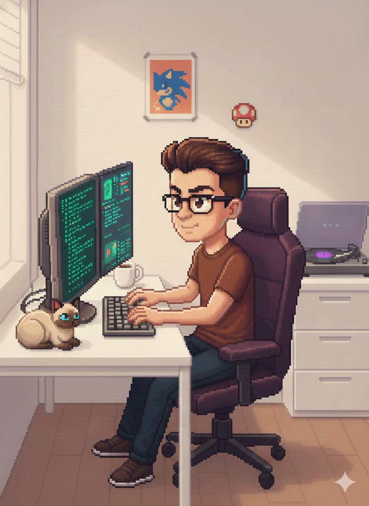

# 👨🏻‍💻 Gabriel Wolf

**`Desenvolvedor`**

Desenvolvedor que sempre teve paixão ao front-end e UI/UX Design 🎨, mas gosto de aprender de tudo e encarar novos horizontes. Me formei em Engenharia de Software na Estácio. Além do trabalho gosto de acompanhar o mercado em geral de tecnologia e criar os meus projetos aqui no Github tanto para aprender ou simplesmente me divertir com o que ando fuçando 🤔. Eu já gostava de café, mas depois que entrei nessa área tech é o meu grande aliado 😅☕.

---

### 🤖 Linguagens e Tecnologias

 
